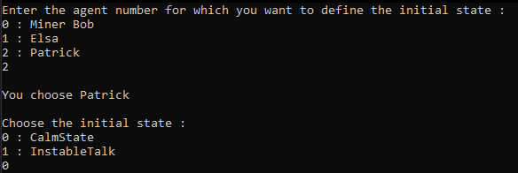

# Communication between state machines.

## About The Project
It's based on a project of Mat Buckland : *"WestWorldMessaging"*.  

My goal was to create a new character with his own finite-state machine.  
He would talk with the other characters creating new states and new possibilities.

For debugging purpose, I also add the possibility to set the initial state for each agent in command line.

⚠️ Elsa can be quiet in some round because she is in the WifesGlobalState. It's a state that requires randomness to change.

## Getting Started
### Usage
1. Open `WestWorldWithMessaging.sln` under *src/Buckland_Chapter2-State Machines/WestWorldWithMessaging*.

2. Choose your character and his own initial state :

3. Enjoy discussions between 3 characters !

## License
Distributed under the MIT License. See `LICENSE` for more information.

## Contact
- Wesley Petit - [Website](https://wesleypetit.fr/) - wesley.petit.lemoine@gmail.com

## Credits
- [Mat Buckland, *"Programming Game AI by Example"*, Chapter 2](http://www.ai-junkie.com/books/toc_pgaibe.html).
